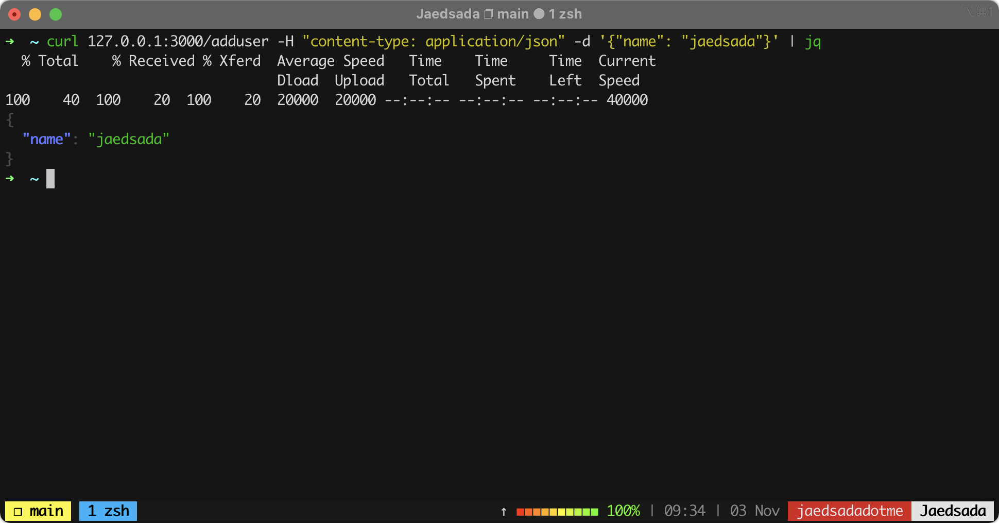
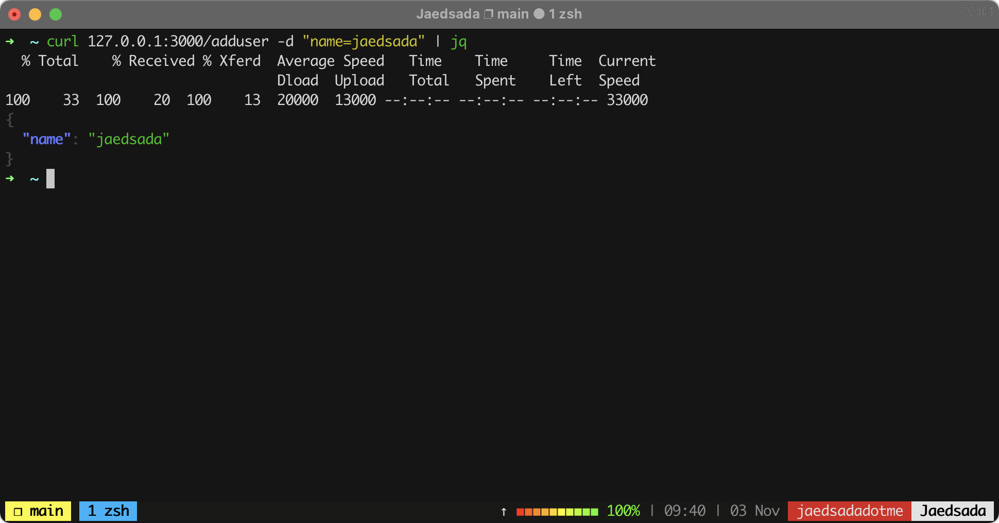

# [Golang] Request

---

### Create ``main.go``
```sh
$ mkdir project
$ touch main.go
```

### Init Go Module

```sh
$ go mod init
```

### Import

```sh
package main

import (
	"net/http"
	"github.com/labstack/echo/v4"
)
```

### Create Struct 

```sh
type User struct {
	Name  string `json:"name" form:"name"`
}
```

### Create Function addName

```sh
func addName(c echo.Context) (err error) {
	u := new(User)
	if err = c.Bind(u); err != nil {
		return
	}
	return c.JSON(http.StatusOK, u)
}
```

### Function main

```sh
func main() {
	e := echo.New()
	e.POST("/adduser", addName)
	e.Logger.Fatal(e.Start(":1323"))
}
```

### Start Serve

```sh
$ go run .

   ____    __
  / __/___/ /  ___
 / _// __/ _ \/ _ \
/___/\__/_//_/\___/ v4.1.17
High performance, minimalist Go web framework
https://echo.labstack.com
____________________________________O/_______
                                    O\
⇨ http server started on [::]:3000
```

---
> ทดสอบ ยิง curl ไป ที่ http://127.0.0.1:3000/adduser

- application/json 
```sh
$ curl 127.0.0.1:3000/adduser -H "content-type: application/json" -d '{"name": "jaedsada"}' | jq
```


- Form Data
```sh
$ curl 127.0.0.1:3000/adduser -d "name=jaedsada" | jq
```

---