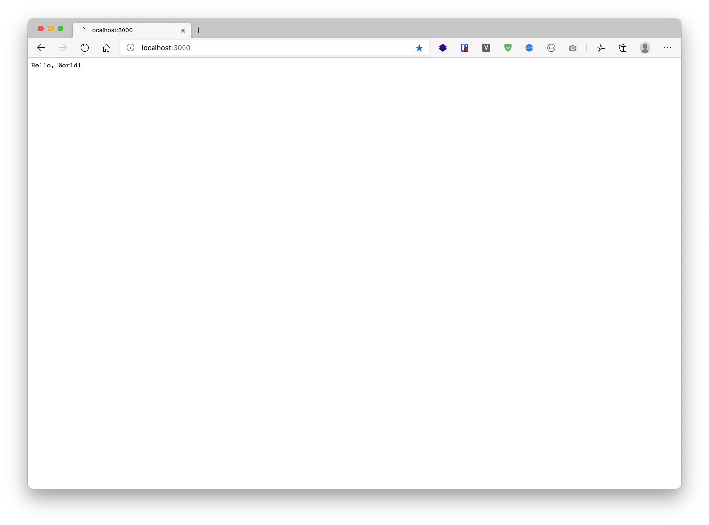

# [Golang] Hello World

---

### Create ``main.go``
```sh
$ mkdir project
$ touch main.go
```

### Init Go Module

```sh
$ go mod init
```

### Import

```sh
package main

import (
	"net/http"
	"github.com/labstack/echo/v4"
)
```

### Function main

```sh
func main() {
	e := echo.New()
	e.GET("/", func(c echo.Context) error {
		return c.String(http.StatusOK, "Hello, World!")
	})
	e.Logger.Fatal(e.Start(":3000"))
}
```

### Start Serve

```sh
$ go run .

   ____    __
  / __/___/ /  ___
 / _// __/ _ \/ _ \
/___/\__/_//_/\___/ v4.1.17
High performance, minimalist Go web framework
https://echo.labstack.com
____________________________________O/_______
                                    O\
⇨ http server started on [::]:3000
```

เปิด browser แล้วเข้า http://localhost:3000

---


