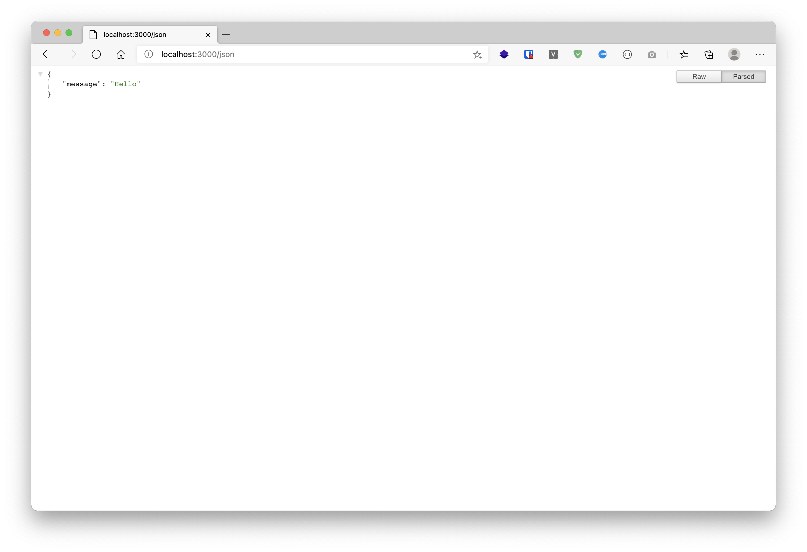
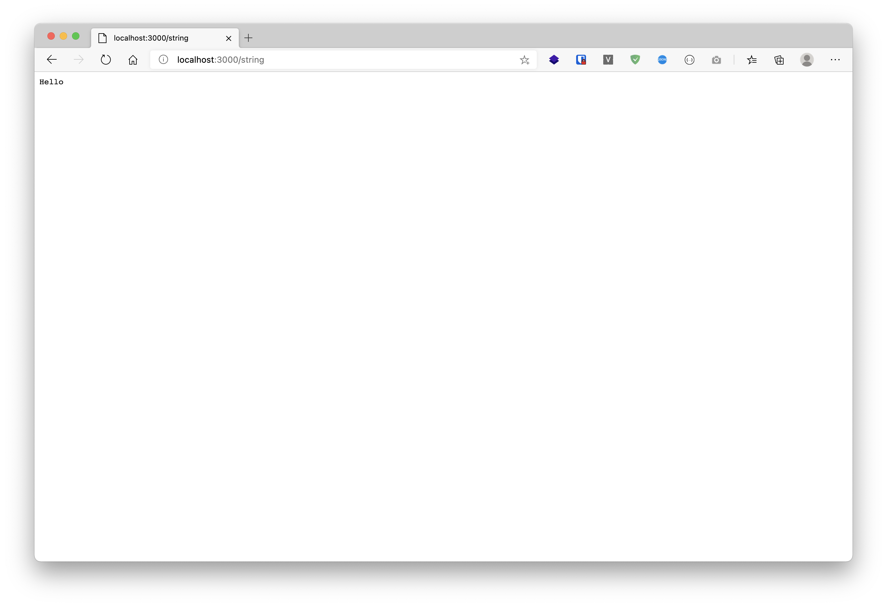
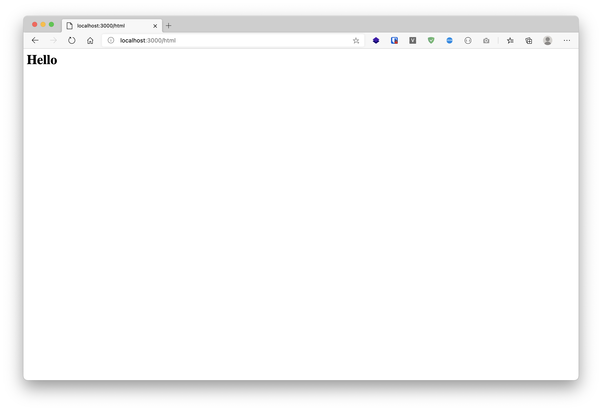
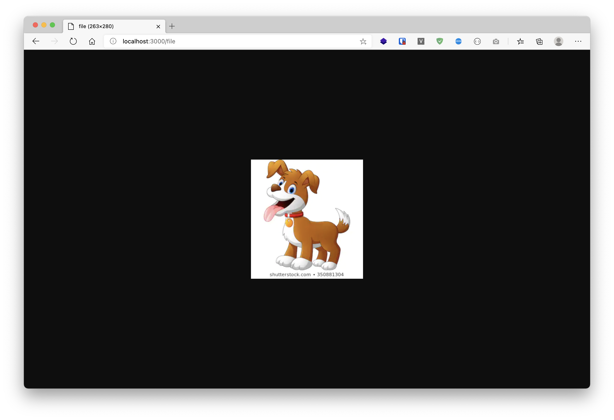

# [Golang] Response

---

### Create ``main.go``
```sh
$ mkdir project
$ touch main.go
```

### Init Go Module

```sh
$ go mod init
```

### Import

```sh
package main

import (
	"net/http"
	"github.com/labstack/echo/v4"
)
```

### Create Function response json

```sh
func ResponseJson(c echo.Context) error {
	dataReponse := map[string]string{
		"message": "Hello",
	}
	return c.JSON(http.StatusOK, dataReponse)
}
```

### Create Function response string

```sh
func ResponseString(c echo.Context) error {
	return c.String(http.StatusOK, "Hello")
}
```

### Create Function response html

```sh
func ResponseHtml(c echo.Context) error {
	return c.HTML(http.StatusOK, "<h1>Hello</h1>")
}
```
### Create Function response file

```sh
func ResponseStream(c echo.Context) error {
	file, err := os.Open("dog.png")
	if err != nil {
		return err
	}
	return c.Stream(http.StatusOK, "image/png", file)
}
```

### Create Function response redirect

```sh
func String(c echo.Context) (err error) {
	return c.Redirect(http.StatusMovedPermanently, "https://google.com")
}
```

### Function main

```sh
func main() {
	e := echo.New()
	e.GET("/json", ResponseJson)
	e.GET("/string", ResponseString)
	e.GET("/html", ResponseHtml)
	e.GET("/file", ResponseStream)
	e.Logger.Fatal(e.Start(":3000"))
}
```

### Start Serve

```sh
$ go run .

   ____    __
  / __/___/ /  ___
 / _// __/ _ \/ _ \
/___/\__/_//_/\___/ v4.1.17
High performance, minimalist Go web framework
https://echo.labstack.com
____________________________________O/_______
                                    O\
⇨ http server started on [::]:3000
```

---
> ทดสอบ เปิด Browser ``http://127.0.0.1:3000

- /json



- /string



- /html



- /file

